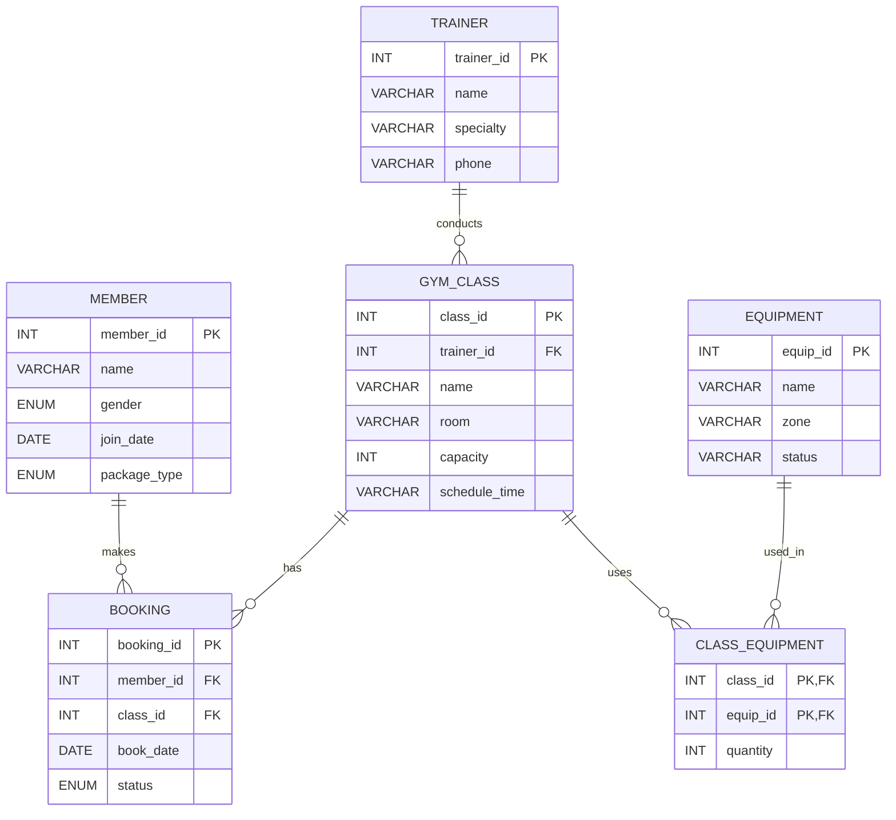

#### 1. ตาราง `member` (สมาชิก)
*เก็บบันทึกข้อมูลของสมาชิกฟิตเนส*
- `member_id` : `INT AUTO_INCREMENT PRIMARY KEY` — รหัสสมาชิก
- `name` : `VARCHAR(100) NOT NULL` — ชื่อ-นามสกุล
- `gender` : `ENUM('male', 'female') NOT NULL` — เพศ (ชาย / หญิง)
- `join_date` : `DATE NOT NULL` — วันที่สมัครสมาชิก
- `package_type` : `ENUM('basic', 'premium') NOT NULL` — ประเภทแพ็กเกจ

#### 2. ตาราง `trainer` (ผู้ฝึกสอน)
*เก็บบันทึกข้อมูลครูฝึกหรือเทรนเนอร์ประจำคลาส*
- `trainer_id` : `INT AUTO_INCREMENT PRIMARY KEY` — รหัสเทรนเนอร์
- `name` : `VARCHAR(100) NOT NULL` — ชื่อเทรนเนอร์
- `specialty` : `VARCHAR(100)` — ความถนัดเฉพาะทาง (เช่น Yoga, Weight Training)
- `phone` : `VARCHAR(20)` — เบอร์โทรศัพท์ติดต่อ

#### 3. ตาราง `gym_class` (คลาสเรียนฟิตเนส)
*ความสัมพันธ์ 1:M จาก `trainer` (1 เทรนเนอร์ สอนได้หลายคลาส)*
- `class_id` : `INT AUTO_INCREMENT PRIMARY KEY` — รหัสคลาส
- `trainer_id` : `INT` — รหัสเทรนเนอร์ผู้สอน (`FK -> trainer.trainer_id`)
- `name` : `VARCHAR(100) NOT NULL` — ชื่อคลาสเรียน
- `room` : `VARCHAR(50) NOT NULL` — ห้องที่ใช้จัดคลาส
- `capacity` : `INT NOT NULL` — จำนวนที่นั่งรับได้สูงสุด
- `schedule_time` : `DATE NOT NULL` — ช่วงเวลาที่เปิดสอน (เช่น '09:00 - 10:00')

#### 4. ตาราง `booking` (การจองคลาส)
*ความสัมพันธ์ M:N ระหว่าง `member` และ `gym_class`*
- `booking_id` : `INT AUTO_INCREMENT PRIMARY KEY` — รหัสการจอง
- `member_id` : `INT NOT NULL` — รหัสสมาชิกผู้จอง (`FK -> member.member_id`)
- `class_id` : `INT NOT NULL` — รหัสคลาสที่จอง (`FK -> gym_class.class_id`)
- `book_date` : `DATE NOT NULL` — วันที่ทำการจอง
- `status` : `ENUM('booked', 'cancelled') NOT NULL DEFAULT 'booked'` — สถานะการจอง

#### 5. ตาราง `equipment` (อุปกรณ์ฟิตเนส)
*เก็บบันทึกอุปกรณ์ฟิตเนสในสถานที่*
- `equip_id` : `INT AUTO_INCREMENT PRIMARY KEY` — รหัสอุปกรณ์
- `name` : `VARCHAR(100) NOT NULL` — ชื่ออุปกรณ์
- `zone` : `VARCHAR(50)` — โซนหรือห้องที่เก็บอุปกรณ์
- `status` : `ENUM('available', 'unavailable') NOT NULL DEFAULT 'available'` — สถานะความพร้อมของอุปกรณ์

#### 6. ตาราง `class_equipment` (อุปกรณ์ที่ใช้ประจำแต่ละคลาส)
*ความสัมพันธ์ M:N ระหว่าง `gym_class` และ `equipment`*
- `class_id` : `INT NOT NULL` — รหัสคลาส (`FK -> gym_class.class_id`)
- `equip_id` : `INT NOT NULL` — รหัสอุปกรณ์ (`FK -> equipment.equip_id`)
- `quantity` : `INT NOT NULL DEFAULT 1` — จำนวนอุปกรณ์ที่ใช้ในคลาสนั้น
- `PRIMARY KEY (class_id, equip_id)`
